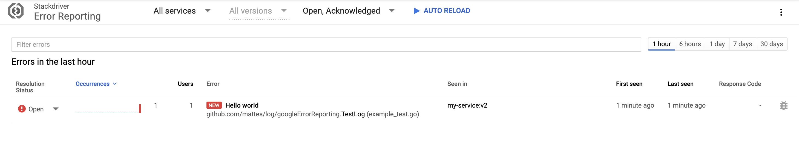

# Google Error Reporting [](https://godoc.org/github.com/mattes/log/googleErrorReporting)

This package implements a Zap core for [Google Cloud Error Reporting](https://cloud.google.com/error-reporting/)
using the official [lib](https://godoc.org/cloud.google.com/go/errorreporting).



## Usage

```go
import (
  gerr "github.com/mattes/log/googleErrorReporting"
  "go.uber.org/zap"
)

c := gerr.NewConfig()
c.ServiceName = "my-service"
c.ServiceVersion = "v2"

core, err := c.Build()
if err != nil {
	panic(err)
}

logger := zap.New(core)
defer logger.Sync()

r := &http.Request{Method: "GET", Host: "example.com", RequestURI: "/"}

logger.Error("Hello world", gerr.User("user123"), gerr.Request(r))
```

