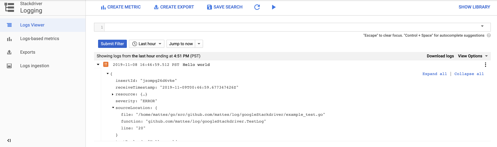

# Google Stackdriver Logging [](https://godoc.org/github.com/mattes/log/googleStackdriver)

This package implements a Zap core for [Google Cloud Stackdriver Logging](https://cloud.google.com/logging/)
using the official [lib](https://godoc.org/cloud.google.com/go/logging).
This logs directly to Stackdriver from within Go. No further agent is required.



## Usage

```go
import (
  "go.uber.org/zap"
  gsdr "github.com/mattes/log/googleStackdriver"
)

c := gsdr.NewConfig()
c.LogID = "my-log" // a unique string identifying this log stream

core, err := c.Build()
if err != nil {
  panic(err)
}

logger := zap.New(core)
defer logger.Sync()

logger.Error("Hello world", gsdr.Trace("trace123"))
```

## Restrictions

* The Google [logging](https://godoc.org/cloud.google.com/go/logging) lib
  doesn't support changing the `Config.LogID` without creating a new logging client.
  Hence [zap#Logger.Named](https://godoc.org/go.uber.org/zap#Logger.Named) will be
  set as [logging#Entry.Label](https://godoc.org/cloud.google.com/go/logging#Entry).
* Field names starting with `_` are considered special and stripped before logged,
  unless they have a special meaning to this core.
