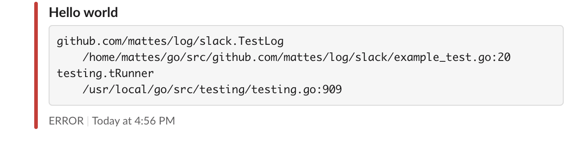

# Slack core [](https://godoc.org/github.com/mattes/log/slack)

This package implements a Zap core which sends messages to Slack.



## Usage

```go
import (
  "github.com/mattes/log/slack"
  "go.uber.org/zap"
)

c := slack.NewConfig()
c.WebhookURL = "https://hooks.slack.com/xxx" // copy from slack
c.Channel = "#general"

core, err := c.Build()
if err != nil {
  panic(err)
}

logger := zap.New(core)
defer logger.Sync()

logger.Error("Hello world")
```

